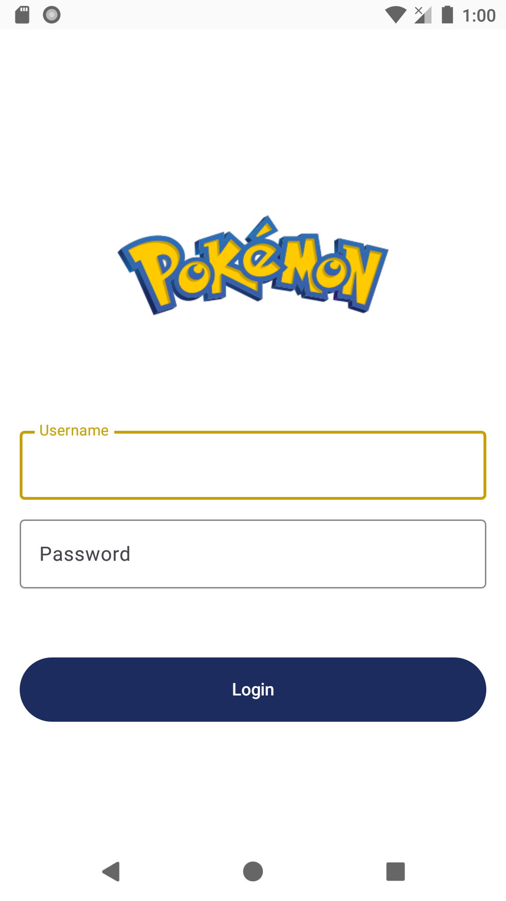
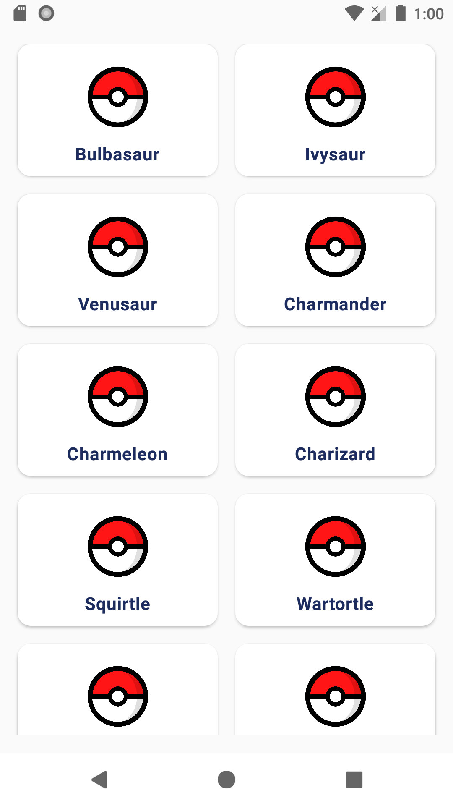
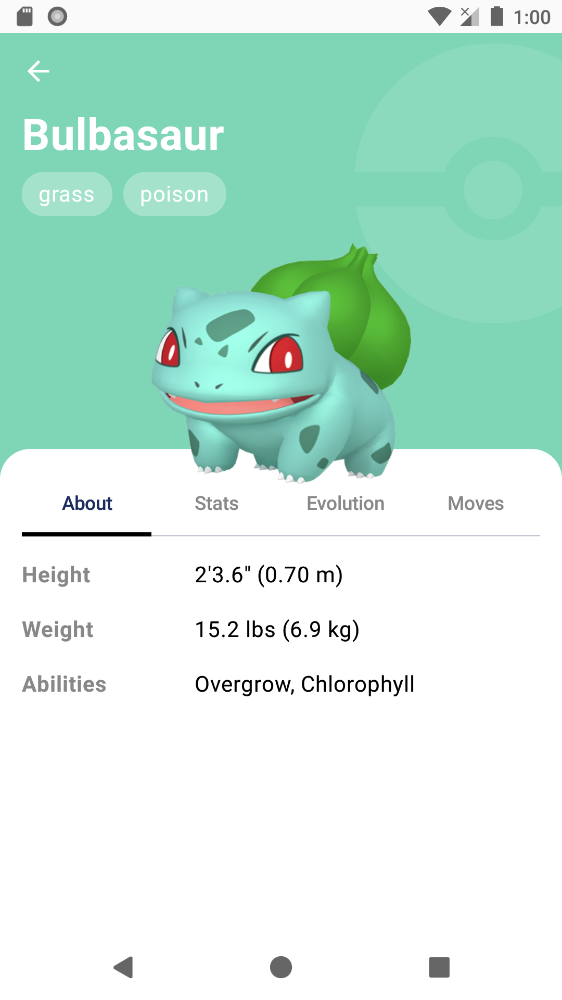

# PokemonApp

A modern Android application that displays Pokemon information using the [PokeAPI](https://pokeapi.co/). Built with Jetpack Compose, Kotlin, and follows modern Android architecture patterns.

## Features

- **Login Screen**: Clean authentication UI with Pokemon-themed design
- **Pokemon List**: Browse Pokemon in a responsive 2-column grid layout
- **Pokemon Details**: View comprehensive information including:
  - Official artwork images
  - Pokemon types with color-coded backgrounds
  - Height and weight (with unit conversion)
  - Abilities list
  - Tabbed interface (About, Stats, Evolution, Moves)
- **Loading States**: Visual feedback during data fetching
- **Error Handling**: Graceful error display when API calls fail

## Screenshots

| Login Screen | Home Screen | Details Screen |
|-------------|-------------|----------------|
|  |  |  |

## Demo


## Tech Stack

### Architecture
- **MVVM Architecture** with Repository pattern
- **Clean Architecture** with separation of concerns:
  - `data/` - Data layer (API, Repository implementation, Mappers)
  - `domain/` - Domain layer (Models, Repository interfaces)
  - `ui/` - Presentation layer (ViewModels, UI State, Screens)

### Core Technologies

| Category | Libraries |
|----------|-----------|
| **UI** | Jetpack Compose (BOM 2024.09.00), Material 3 |
| **Networking** | Ktor Client (3.4.0) with OkHttp engine |
| **Dependency Injection** | Hilt (2.57.1) |
| **Navigation** | Jetpack Navigation Compose (2.9.4) |
| **Image Loading** | Coil (3.3.0) |
| **Serialization** | Gson via Ktor Content Negotiation |

### External Dependencies

#### Jetpack Compose
```kotlin
androidx.compose:compose-bom:2024.09.00
androidx.compose.ui:ui
androidx.compose.material3:material3
androidx.activity:activity-compose:1.8.0
androidx.lifecycle:lifecycle-runtime-ktx:2.6.1
```

#### Dependency Injection (Hilt)
```kotlin
com.google.dagger:hilt-android:2.57.1
com.google.dagger:hilt-android-compiler:2.57.1
androidx.hilt:hilt-navigation-compose:1.3.0
```

#### Networking (Ktor)
```kotlin
io.ktor:ktor-client-core:3.4.0
io.ktor:ktor-client-okhttp:3.4.0
io.ktor:ktor-client-android:3.4.0
io.ktor:ktor-client-content-negotiation:3.4.0
io.ktor:ktor-serialization-gson:3.3.0
```

#### Image Loading (Coil)
```kotlin
io.coil-kt.coil3:coil-compose:3.3.0
io.coil-kt.coil3:coil-network-okhttp:3.3.0
```

#### Navigation
```kotlin
androidx.navigation:navigation-compose:2.9.4
```

## Project Structure

```
app/src/main/java/com/treceniomarvin/pokemonapp/
├── data/
│   ├── mapper/
│   │   ├── PokemonDetailsMapper.kt    # DTO to Domain mapping
│   │   └── PokemonListMapper.kt         # List DTO to Domain mapping
│   ├── model/
│   │   ├── details/                    # Details API response models
│   │   └── list/                       # List API response models
│   └── PokemonRepositoryImpl.kt        # Repository implementation
├── domain/
│   ├── Pokemon.kt                      # Basic Pokemon model
│   ├── PokemonDetails.kt               # Detailed Pokemon model
│   └── PokemonRepository.kt            # Repository interface
├── ui/
│   ├── screens/
│   │   ├── LoginScreen.kt              # Login UI
│   │   ├── MainScreen.kt               # Navigation host
│   │   ├── HomeScreen.kt               # Pokemon list grid
│   │   ├── DetailsScreen.kt            # Pokemon details
│   │   └── LoadingScreen.kt            # Loading indicator
│   ├── GetPokemonListUiState.kt        # List UI state
│   ├── GetPokemonDetailsUiState.kt     # Details UI state
│   ├── PokemonViewModel.kt             # Business logic
│   └── Status.kt                       # Operation status enum
├── core/
│   └── PokemonUnitConverter.kt         # Height/weight conversion
├── theme/
│   ├── Color.kt                        # App colors
│   └── Type.kt                         # Type color mapping
└── MainActivity.kt
```

## Setup Instructions

### Prerequisites

- **Android Studio**: Ladybug (2024.2.1) or newer
- **JDK**: Java 11 or higher
- **Android SDK**: API 23+ (Android 6.0)
- **Kotlin**: 2.0.21+

### Installation

1. **Clone the repository**
   ```bash
   git clone https://github.com/yourusername/PokemonApp.git
   cd PokemonApp
   ```

2. **Open in Android Studio**
   - Launch Android Studio
   - Select "Open an existing project"
   - Navigate to the cloned `PokemonApp` folder

3. **Sync Project**
   - Android Studio will automatically sync Gradle files
   - If not, click `File > Sync Project with Gradle Files`

4. **Build the project**
   ```bash
   ./gradlew build
   ```

5. **Run the app**
   - Connect an Android device or start an emulator (API 23+)
   - Click the **Run** button (▶) in Android Studio
   - Or use: `./gradlew installDebug`

## API Reference

This app uses the [PokeAPI](https://pokeapi.co/) - a free RESTful API for Pokemon data.

### Endpoints Used

| Endpoint | Description |
|----------|-------------|
| `GET /api/v2/pokemon?limit=20` | Fetch list of 20 Pokemon |
| `GET /api/v2/pokemon/{name}` | Fetch details for a specific Pokemon |

### Data Mapping

- **Height**: Converted from decimeters to meters (÷ 10)
- **Weight**: Converted from hectograms to kilograms (÷ 10)

## Architecture Decisions

### Why Ktor over Retrofit?
- Native Kotlin support with coroutines
- Built-in content negotiation
- Lightweight and flexible

### Why Hilt?
- Google's recommended DI solution for Android
- Compile-time safety
- Easy ViewModel injection

### Why Coil?
- First-class Compose support
- Kotlin-native (unlike Glide)
- Automatic memory management

## Future Enhancements

- [ ] Implement Stats, Evolution, and Moves tabs
- [ ] Add search functionality
- [ ] Add pagination/infinite scroll
- [ ] Implement offline caching with Room
- [ ] Add unit and integration tests
- [ ] Implement pull-to-refresh
- [ ] Add Pokemon type filters

## License

```
Copyright 2026 Marvin Trecenio

Licensed under the Apache License, Version 2.0 (the "License");
you may not use this file except in compliance with the License.
You may obtain a copy of the License at

    http://www.apache.org/licenses/LICENSE-2.0

Unless required by applicable law or agreed to in writing, software
distributed under the License is distributed on an "AS IS" BASIS,
WITHOUT WARRANTIES OR CONDITIONS OF ANY KIND, either express or implied.
See the License for the specific language governing permissions and
limitations under the License.
```

## Acknowledgments

- [PokeAPI](https://pokeapi.co/) for providing the Pokemon data
- [Pokemon](https://www.pokemon.com/) for the inspiration
